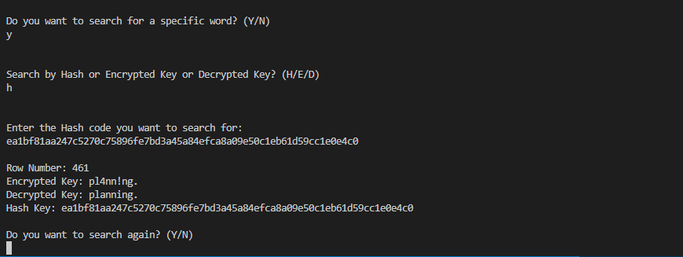

# Rainbow-Table

A simple project which represents how the rainbow table works, the decryption algorithm is so simple and this is a command line app

---

### Program Intro

### Output Table

### Search for a specific key either by Hash or Encrypted or Decrypted Key

_Any suggestion and contribution will be thankful!_
