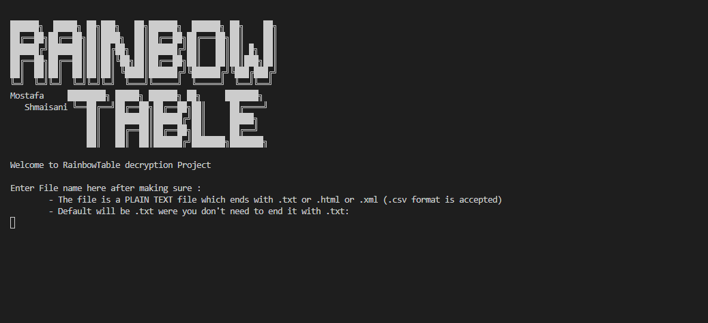
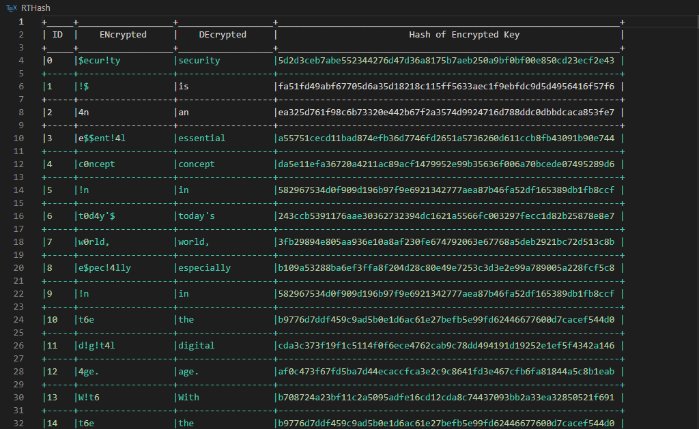

# Rainbow-Table

A simple project which represents how the rainbow table works, the decryption algorithm is so simple and this is a command line app

_Any suggestion and contribution will be thankful!_
